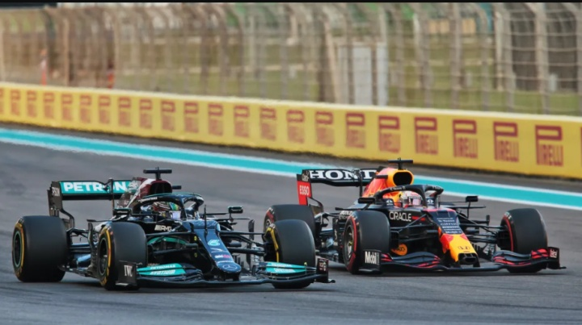

# 🏎️ F1 影响最深远的12场大奖赛

一个展示 F1 历史上最具影响力、最具转折意义的12场大奖赛的前端网页项目。



## 📖 项目简介

本项目精心挑选了 F1 七十余年历史中最具标志性的12场大奖赛，通过时间轴设计呈现每场比赛的故事、意义和历史地位。每场比赛都配有详尽的深度解析文章，带您重温那些改变赛车运动历史的关键时刻。

## ✨ 功能特性

- **时间轴设计**：中轴红色主题线 + 左右交替卡片布局
- **12场经典赛事**：从1950年首场F1比赛到2021年最具争议的收官战
- **深度解析**：每场比赛配有2000+字的详细故事和历史背景
- **响应式设计**：适配桌面和移动端
- **纯静态页面**：无需服务器，直接打开 HTML 文件即可浏览

## 🏁 入选的12场大奖赛

| 年份 | 赛事 | 冠军车手 | 入选理由 |
|------|------|----------|----------|
| 1950 | 🇬🇧 英国大奖赛 | 朱塞佩·法里纳 | F1世界锦标赛首场比赛 |
| 1957 | 🇩🇪 德国大奖赛 | 胡安·曼努埃尔·方吉奥 | 46岁车手的绝地反击，"大师的杰作" |
| 1971 | 🇮🇹 意大利大奖赛 | 彼特·吉ethin | 前五名0.61秒内冲过终点 |
| 1976 | 🇯🇵 日本大奖赛 | 詹姆斯·亨特 | 亨特与劳达的终极冠军争夺战 |
| 1979 | 🇫🇷 法国大奖赛 | 吉尔·维伦纽夫 | 序列式变速箱首次亮相，技术革命开端 |
| 1982 | 🇲🇨 摩纳哥大奖赛 | 阿兰·普罗斯特 | F1历史上最戏剧性的比赛之一 |
| 1993 | 🇬🇧 欧洲大奖赛 | 埃尔顿·塞纳 | "神之圈"——雨战中的神级一圈 |
| 1994 | 🇮🇹 圣马力诺大奖赛 | 迈克尔·舒马赫 | F1最黑暗的周末，塞纳永远离去 |
| 2008 | 🇧🇷 巴西大奖赛 | 刘易斯·汉密尔顿 | 最后一圈最后一刻的不可思议逆转 |
| 2011 | 🇨🇦 加拿大大奖赛 | 简森·巴顿 | 4小时+6次进站后最后一圈夺冠 |
| 2016 | 🇲🇾 马来西亚大奖赛 | 尼科·罗斯伯格 | 汉密尔顿爆缸，赛季转折点 |
| 2021 | 🇦🇪 阿布扎比大奖赛 | 马克斯·维斯塔潘 | F1历史上最具争议的收官战 |

## 📁 项目结构

```
F1/
├── index.html          # 时间轴主页（12场比赛卡片）
├── detail.html         # 比赛详情页（深度解析文章）
├── criteria.html       # 筛选标准说明页
├── races.json          # 原始比赛数据（JSON格式）
├── README.md           # 项目说明文档
└── images/             # 比赛封面图片
    ├── 1950-british-gp.jpg
    ├── 1957-german-gp.webp
    ├── 1971-italian-gp.webp
    ├── 1976-japanese-gp.jpg
    ├── 1979-french-gp.jpg
    ├── 1982-monaco-gp.webp
    ├── 1993-european-gp.webp
    ├── 2008-brazilian-gp.webp
    ├── 2011-canadian-gp.webp
    ├── 2016-malaysian-gp.webp
    └── 2021-abu-dhabi-gp.jpg
```

> 注：1994年圣马力诺大奖赛采用特殊纪念风格（无封面图片），以致敬永远的车神埃尔顿·塞纳。

## 🚀 快速开始

1. 克隆项目
   ```bash
   git clone https://github.com/your-username/f1-greatest-races.git
   cd f1-greatest-races
   ```

2. 直接在浏览器中打开 `index.html`

3. 点击任意比赛卡片查看详细解析

## 🛠️ 技术栈

- **HTML5** - 页面结构
- **CSS3** - 样式与动画（F1主题配色）
- **Vanilla JavaScript** - 交互逻辑
- **Google Fonts** - Space Grotesk + Inter 字体

## 🎨 设计理念

- **配色方案**：深色背景 `#0a0a0a` + F1经典红 `#e10600`
- **字体搭配**：Space Grotesk（标题/数据） + Inter（正文）
- **交互设计**：悬停高亮、流畅过渡动画
- **1994致敬**：圣马力诺大奖赛采用独特的暗色纪念风格

## 📄 License

MIT License

---

*速度与激情，永不熄灭。🏎️💨*
